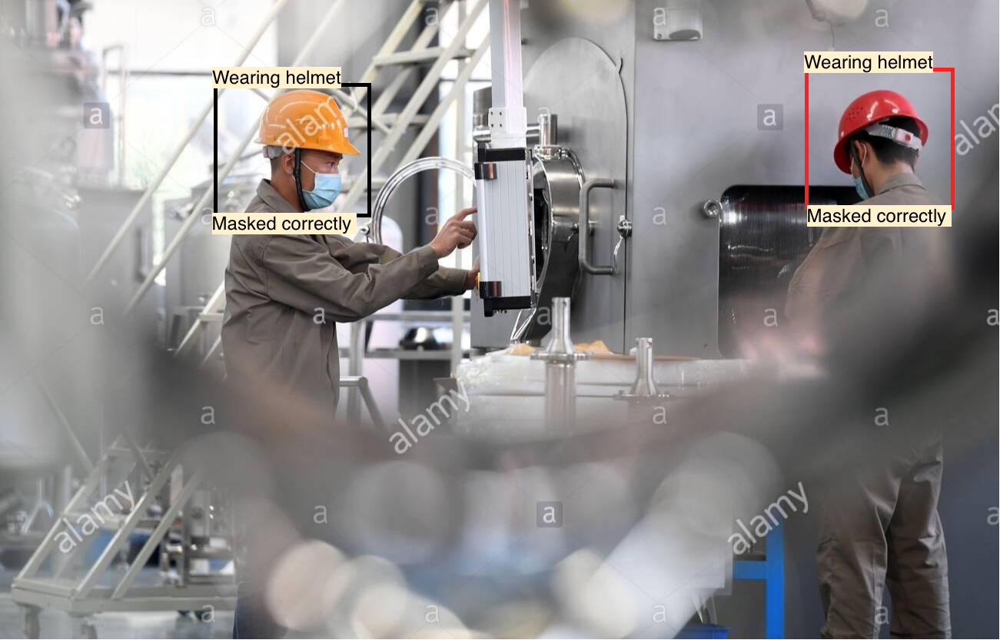
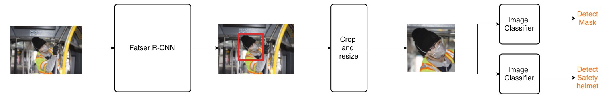

# Framework <span id = "top"></span>

This is a highly felxible framework for a vision system that performs **coarse-grained** object detection from RGB images and **classifies** the detected objects basd on **fine-grained attributes**.

### Where can this setup be useful ?

This setup can be applied to a wide range of use-cases.  

Let's look at a specific example. Say you want to identify how many workers in a factory are following safety protocols viz. _are they wearing saftey helmets or not? are they wearing masks properly ?_



Such a task would first require you to identify all the faces/heads of people visible in the image and then for each face/head classify them into one of many attribute specific classes. For example,
- safety_helmet : _wearing / not wearing_
- masks : _wearing correctly / incorrectly / not wearing at all_

This aproach can be easily extended to custom use-cases and datasets.  

----

# Contents

* [Architecture](#arch)
* [Prerequisites](#prerequisites)
* [Data](#data)
* [Training](#train)
* [Inference](#inf)

----

# Architecture <span id = "arch"></span>


The detection pipeline can be divided into two stages :

**Stage 1** : First, an object detector network (Faster-RCNN) is used to predict bounding boxes containing corase-grained objects (ex: heads/faces) in the image. In the above example he bounding boxe classes predicted by this network could be head/face, non-head object, background. 

**Stage 2** : Next, two parallel CNN based image classifier networks are used to classify the detected head bounding boxes according to the presence of mask and safety helmets as described in the intro. 

_Two separate classifiers are used instead of a single multi-task setup, to make the system modular with respect to the fine-grained attributes._


# Prerequisites <span id = "prerequisites"></span>
```
keras-gpu
tensorflow-gpu
CUDA
cuDNN
Python
Opencv
scikit-learn
h5py
numpy
pandas
xml
Scipy
```


# Data <span id = "data"></span>

The training data should contain the following annotations for every image :

* object
    * label _(ex. head / non_head / background)_
    * bounding box co-ordinates : _(x,y) top left & bottom right_
    * attribute : _type (ex. mask) and class (ex. wearing correctly)_

The annotations for training should be in the following XML format :
```xml
<annotations>
...
<image id="..." name="...">
    <box label="..." xtl="..." ytl="..." xbr="..." ybr="...">
      <attribute name="type1">class</attribute>
      <attribute name="type2">class</attribute>
      ...
    </box>
    ...
</image>
...
</annotations>

```

An example dataset with images and annotations can be found [here](https://drive.google.com/drive/folders/1TFjsTFspmtyViBOmuCo-tBbXZ72GhVuG?usp=sharing)


# Training <span id = "train"></span>

1. Generate training samples for object detector and classifier networks.  
```
python gen_training_data.py --train_annotations ANNOTATION_PATH --train_images IMAGES_PATH --format IMAGE_FORMAT
```
2. Train object detector. 
```
python keras-frcnn/train_frcnn.py
```

3. Train classifier networks.
```
python safety_helmet_classifier_train.py
python mask_classifier_train.py
```

# Inference <span id = "inf"></span>

1. Get coarse predictions from object detector.
```
python keras-frcnn/test_frcnn.py -p TEST_IMAGES_PATH -o COARSE_OUTPUT_PATH
```
The coarse predictions can be found in 'COARSE_OUTPUT_PATH/frcnnoutput.csv' in the following format :
```
image_name,xtl,ytl,xbr,ybr,coarse_label
```

2. Get fine attribute predictions from classifier networks.
```
python complete_classifier_network_test.py --object_preds COARSE_OUTPUT_PATH/frcnnoutput.csv --output FINE_OUTPUT_PATH
```
the fine predictions will be in the following format :
```
image_name,xtl=,ytl=,xbr=,ybr=,mask=class,helmet=class
```


